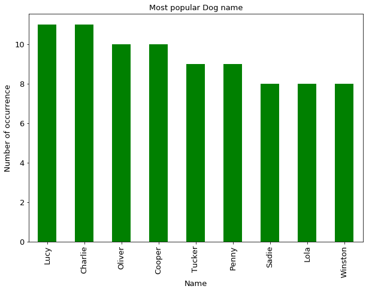
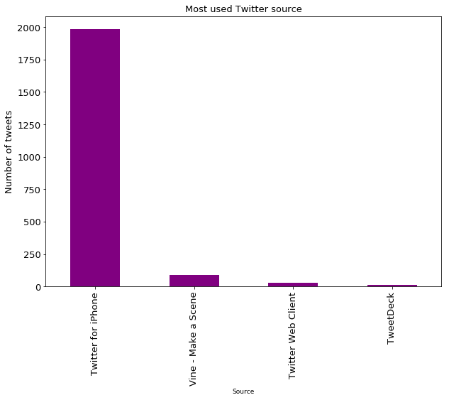
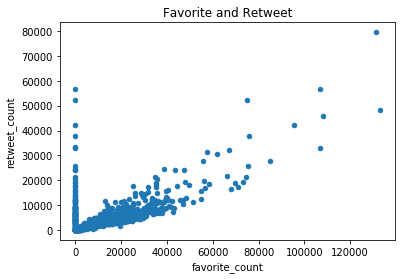

# Project: Wrangling and Analyze Data

## Data Gathering
In the cell below, gather **all** three pieces of data for this project and load them in the notebook. **Note:** the methods required to gather each data are different.
1. Directly download the WeRateDogs Twitter archive data (twitter_archive_enhanced.csv)


```python
#Libraries to be used

import pandas as pd
import numpy as np
import matplotlib.pyplot as plt
%matplotlib inline
import seaborn as sns
import json
import os
import requests
import tweepy
```


```python
#read data
twitter_archive = pd.read_csv('twitter-archive-enhanced.csv')
```

2. Use the Requests library to download the tweet image prediction (image_predictions.tsv)


```python
#Download tweet image predictions TSV using the Requests library and write it to image_predictions.tsv
url = 'https://d17h27t6h515a5.cloudfront.net/topher/2017/August/599fd2ad_image-predictions/image-predictions.tsv'
filename =url.split('/')[-1]

if not os.path.exists(filename):
    response = requests.get(url)
    with open(filename, mode='wb') as file:
        file.write(response.content)
    
#Import the tweet image predictions TSV file into a DataFrame
image_prediction = pd.read_csv('image-predictions.tsv', sep='\t')
```

3. Use the Tweepy library to query additional data via the Twitter API (tweet_json.txt)


```python
# downloding the 
```


```python
# Read the tweet json file line by line
with open('tweet-json copy', 'r') as file:
    lines = file.readlines()
```


```python
# Extracting the needed data from the downloaded content
twitter_list = []

# Read the .txt file line by line into a list of dictionaries
for line in open('tweet-json copy', 'r'):
    twitter_data = json.loads(line)
    twitter_list.append({'tweet_id': twitter_data['id_str'],
                        'retweet_count': twitter_data['retweet_count'],
                        'favorite_count': twitter_data['favorite_count'],
                        'followers_count': twitter_data['user']['followers_count']})
```


```python
# Convert the list of dictionaries to a pandas DataFrame
twitter_data = pd.DataFrame(twitter_list, columns = ['tweet_id', 'retweet_count', 'favorite_count', 'followers_count'])
```

## Assessing Data
In this section, detect and document at least **eight (8) quality issues and two (2) tidiness issue**. You must use **both** visual assessment
programmatic assessement to assess the data.

**Note:** pay attention to the following key points when you access the data.

* You only want original ratings (no retweets) that have images. Though there are 5000+ tweets in the dataset, not all are dog ratings and some are retweets.
* Assessing and cleaning the entire dataset completely would require a lot of time, and is not necessary to practice and demonstrate your skills in data wrangling. Therefore, the requirements of this project are only to assess and clean at least 8 quality issues and at least 2 tidiness issues in this dataset.
* The fact that the rating numerators are greater than the denominators does not need to be cleaned. This [unique rating system](http://knowyourmeme.com/memes/theyre-good-dogs-brent) is a big part of the popularity of WeRateDogs.
* You do not need to gather the tweets beyond August 1st, 2017. You can, but note that you won't be able to gather the image predictions for these tweets since you don't have access to the algorithm used.


```python
 twitter_data.head(5)
```


<div>
<style scoped>
    .dataframe tbody tr th:only-of-type {
        vertical-align: middle;
    }

    .dataframe tbody tr th {
        vertical-align: top;
    }

    .dataframe thead th {
        text-align: right;
    }
</style>
<table border="1" class="dataframe">
  <thead>
    <tr style="text-align: right;">
      <th></th>
      <th>tweet_id</th>
      <th>retweet_count</th>
      <th>favorite_count</th>
      <th>followers_count</th>
    </tr>
  </thead>
  <tbody>
    <tr>
      <th>0</th>
      <td>892420643555336193</td>
      <td>8853</td>
      <td>39467</td>
      <td>3200889</td>
    </tr>
    <tr>
      <th>1</th>
      <td>892177421306343426</td>
      <td>6514</td>
      <td>33819</td>
      <td>3200889</td>
    </tr>
    <tr>
      <th>2</th>
      <td>891815181378084864</td>
      <td>4328</td>
      <td>25461</td>
      <td>3200889</td>
    </tr>
    <tr>
      <th>3</th>
      <td>891689557279858688</td>
      <td>8964</td>
      <td>42908</td>
      <td>3200889</td>
    </tr>
    <tr>
      <th>4</th>
      <td>891327558926688256</td>
      <td>9774</td>
      <td>41048</td>
      <td>3200889</td>
    </tr>
  </tbody>
</table>
</div>


```python
twitter_data.info()
```

    <class 'pandas.core.frame.DataFrame'>
    RangeIndex: 2354 entries, 0 to 2353
    Data columns (total 4 columns):
    tweet_id           2354 non-null object
    retweet_count      2354 non-null int64
    favorite_count     2354 non-null int64
    followers_count    2354 non-null int64
    dtypes: int64(3), object(1)
    memory usage: 73.6+ KB


```python
image_prediction.head()
```


<div>
<style scoped>
    .dataframe tbody tr th:only-of-type {
        vertical-align: middle;
    }

    .dataframe tbody tr th {
        vertical-align: top;
    }

    .dataframe thead th {
        text-align: right;
    }
</style>
<table border="1" class="dataframe">
  <thead>
    <tr style="text-align: right;">
      <th></th>
      <th>tweet_id</th>
      <th>jpg_url</th>
      <th>img_num</th>
      <th>p1</th>
      <th>p1_conf</th>
      <th>p1_dog</th>
      <th>p2</th>
      <th>p2_conf</th>
      <th>p2_dog</th>
      <th>p3</th>
      <th>p3_conf</th>
      <th>p3_dog</th>
    </tr>
  </thead>
  <tbody>
    <tr>
      <th>0</th>
      <td>666020888022790149</td>
      <td>https://pbs.twimg.com/media/CT4udn0WwAA0aMy.jpg</td>
      <td>1</td>
      <td>Welsh_springer_spaniel</td>
      <td>0.465074</td>
      <td>True</td>
      <td>collie</td>
      <td>0.156665</td>
      <td>True</td>
      <td>Shetland_sheepdog</td>
      <td>0.061428</td>
      <td>True</td>
    </tr>
    <tr>
      <th>1</th>
      <td>666029285002620928</td>
      <td>https://pbs.twimg.com/media/CT42GRgUYAA5iDo.jpg</td>
      <td>1</td>
      <td>redbone</td>
      <td>0.506826</td>
      <td>True</td>
      <td>miniature_pinscher</td>
      <td>0.074192</td>
      <td>True</td>
      <td>Rhodesian_ridgeback</td>
      <td>0.072010</td>
      <td>True</td>
    </tr>
    <tr>
      <th>2</th>
      <td>666033412701032449</td>
      <td>https://pbs.twimg.com/media/CT4521TWwAEvMyu.jpg</td>
      <td>1</td>
      <td>German_shepherd</td>
      <td>0.596461</td>
      <td>True</td>
      <td>malinois</td>
      <td>0.138584</td>
      <td>True</td>
      <td>bloodhound</td>
      <td>0.116197</td>
      <td>True</td>
    </tr>
    <tr>
      <th>3</th>
      <td>666044226329800704</td>
      <td>https://pbs.twimg.com/media/CT5Dr8HUEAA-lEu.jpg</td>
      <td>1</td>
      <td>Rhodesian_ridgeback</td>
      <td>0.408143</td>
      <td>True</td>
      <td>redbone</td>
      <td>0.360687</td>
      <td>True</td>
      <td>miniature_pinscher</td>
      <td>0.222752</td>
      <td>True</td>
    </tr>
    <tr>
      <th>4</th>
      <td>666049248165822465</td>
      <td>https://pbs.twimg.com/media/CT5IQmsXIAAKY4A.jpg</td>
      <td>1</td>
      <td>miniature_pinscher</td>
      <td>0.560311</td>
      <td>True</td>
      <td>Rottweiler</td>
      <td>0.243682</td>
      <td>True</td>
      <td>Doberman</td>
      <td>0.154629</td>
      <td>True</td>
    </tr>
  </tbody>
</table>
</div>


```python
image_prediction.info()
```

    <class 'pandas.core.frame.DataFrame'>
    RangeIndex: 2075 entries, 0 to 2074
    Data columns (total 12 columns):
    tweet_id    2075 non-null int64
    jpg_url     2075 non-null object
    img_num     2075 non-null int64
    p1          2075 non-null object
    p1_conf     2075 non-null float64
    p1_dog      2075 non-null bool
    p2          2075 non-null object
    p2_conf     2075 non-null float64
    p2_dog      2075 non-null bool
    p3          2075 non-null object
    p3_conf     2075 non-null float64
    p3_dog      2075 non-null bool
    dtypes: bool(3), float64(3), int64(2), object(4)
    memory usage: 152.1+ KB


```python
twitter_archive.head(5)
```


<div>
<style scoped>
    .dataframe tbody tr th:only-of-type {
        vertical-align: middle;
    }

    .dataframe tbody tr th {
        vertical-align: top;
    }

    .dataframe thead th {
        text-align: right;
    }
</style>
<table border="1" class="dataframe">
  <thead>
    <tr style="text-align: right;">
      <th></th>
      <th>tweet_id</th>
      <th>in_reply_to_status_id</th>
      <th>in_reply_to_user_id</th>
      <th>timestamp</th>
      <th>source</th>
      <th>text</th>
      <th>retweeted_status_id</th>
      <th>retweeted_status_user_id</th>
      <th>retweeted_status_timestamp</th>
      <th>expanded_urls</th>
      <th>rating_numerator</th>
      <th>rating_denominator</th>
      <th>name</th>
      <th>doggo</th>
      <th>floofer</th>
      <th>pupper</th>
      <th>puppo</th>
    </tr>
  </thead>
  <tbody>
    <tr>
      <th>0</th>
      <td>892420643555336193</td>
      <td>NaN</td>
      <td>NaN</td>
      <td>2017-08-01 16:23:56 +0000</td>
      <td>&lt;a href="http://twitter.com/download/iphone" r...</td>
      <td>This is Phineas. He's a mystical boy. Only eve...</td>
      <td>NaN</td>
      <td>NaN</td>
      <td>NaN</td>
      <td>https://twitter.com/dog_rates/status/892420643...</td>
      <td>13</td>
      <td>10</td>
      <td>Phineas</td>
      <td>None</td>
      <td>None</td>
      <td>None</td>
      <td>None</td>
    </tr>
    <tr>
      <th>1</th>
      <td>892177421306343426</td>
      <td>NaN</td>
      <td>NaN</td>
      <td>2017-08-01 00:17:27 +0000</td>
      <td>&lt;a href="http://twitter.com/download/iphone" r...</td>
      <td>This is Tilly. She's just checking pup on you....</td>
      <td>NaN</td>
      <td>NaN</td>
      <td>NaN</td>
      <td>https://twitter.com/dog_rates/status/892177421...</td>
      <td>13</td>
      <td>10</td>
      <td>Tilly</td>
      <td>None</td>
      <td>None</td>
      <td>None</td>
      <td>None</td>
    </tr>
    <tr>
      <th>2</th>
      <td>891815181378084864</td>
      <td>NaN</td>
      <td>NaN</td>
      <td>2017-07-31 00:18:03 +0000</td>
      <td>&lt;a href="http://twitter.com/download/iphone" r...</td>
      <td>This is Archie. He is a rare Norwegian Pouncin...</td>
      <td>NaN</td>
      <td>NaN</td>
      <td>NaN</td>
      <td>https://twitter.com/dog_rates/status/891815181...</td>
      <td>12</td>
      <td>10</td>
      <td>Archie</td>
      <td>None</td>
      <td>None</td>
      <td>None</td>
      <td>None</td>
    </tr>
    <tr>
      <th>3</th>
      <td>891689557279858688</td>
      <td>NaN</td>
      <td>NaN</td>
      <td>2017-07-30 15:58:51 +0000</td>
      <td>&lt;a href="http://twitter.com/download/iphone" r...</td>
      <td>This is Darla. She commenced a snooze mid meal...</td>
      <td>NaN</td>
      <td>NaN</td>
      <td>NaN</td>
      <td>https://twitter.com/dog_rates/status/891689557...</td>
      <td>13</td>
      <td>10</td>
      <td>Darla</td>
      <td>None</td>
      <td>None</td>
      <td>None</td>
      <td>None</td>
    </tr>
    <tr>
      <th>4</th>
      <td>891327558926688256</td>
      <td>NaN</td>
      <td>NaN</td>
      <td>2017-07-29 16:00:24 +0000</td>
      <td>&lt;a href="http://twitter.com/download/iphone" r...</td>
      <td>This is Franklin. He would like you to stop ca...</td>
      <td>NaN</td>
      <td>NaN</td>
      <td>NaN</td>
      <td>https://twitter.com/dog_rates/status/891327558...</td>
      <td>12</td>
      <td>10</td>
      <td>Franklin</td>
      <td>None</td>
      <td>None</td>
      <td>None</td>
      <td>None</td>
    </tr>
  </tbody>
</table>
</div>


```python
twitter_archive.info()
```

    <class 'pandas.core.frame.DataFrame'>
    RangeIndex: 2356 entries, 0 to 2355
    Data columns (total 17 columns):
    tweet_id                      2356 non-null int64
    in_reply_to_status_id         78 non-null float64
    in_reply_to_user_id           78 non-null float64
    timestamp                     2356 non-null object
    source                        2356 non-null object
    text                          2356 non-null object
    retweeted_status_id           181 non-null float64
    retweeted_status_user_id      181 non-null float64
    retweeted_status_timestamp    181 non-null object
    expanded_urls                 2297 non-null object
    rating_numerator              2356 non-null int64
    rating_denominator            2356 non-null int64
    name                          2356 non-null object
    doggo                         2356 non-null object
    floofer                       2356 non-null object
    pupper                        2356 non-null object
    puppo                         2356 non-null object
    dtypes: float64(4), int64(3), object(10)
    memory usage: 313.0+ KB


```python
twitter_archive[['rating_numerator', 'rating_denominator']].describe()
```


<div>
<style scoped>
    .dataframe tbody tr th:only-of-type {
        vertical-align: middle;
    }

    .dataframe tbody tr th {
        vertical-align: top;
    }

    .dataframe thead th {
        text-align: right;
    }
</style>
<table border="1" class="dataframe">
  <thead>
    <tr style="text-align: right;">
      <th></th>
      <th>rating_numerator</th>
      <th>rating_denominator</th>
    </tr>
  </thead>
  <tbody>
    <tr>
      <th>count</th>
      <td>2356.000000</td>
      <td>2356.000000</td>
    </tr>
    <tr>
      <th>mean</th>
      <td>13.126486</td>
      <td>10.455433</td>
    </tr>
    <tr>
      <th>std</th>
      <td>45.876648</td>
      <td>6.745237</td>
    </tr>
    <tr>
      <th>min</th>
      <td>0.000000</td>
      <td>0.000000</td>
    </tr>
    <tr>
      <th>25%</th>
      <td>10.000000</td>
      <td>10.000000</td>
    </tr>
    <tr>
      <th>50%</th>
      <td>11.000000</td>
      <td>10.000000</td>
    </tr>
    <tr>
      <th>75%</th>
      <td>12.000000</td>
      <td>10.000000</td>
    </tr>
    <tr>
      <th>max</th>
      <td>1776.000000</td>
      <td>170.000000</td>
    </tr>
  </tbody>
</table>
</div>


```python
twitter_archive.name.value_counts()
```


    None       745
    a           55
    Charlie     12
    Oliver      11
    Lucy        11
    Cooper      11
    Lola        10
    Tucker      10
    Penny       10
    Bo           9
    Winston      9
    the          8
    Sadie        8
    an           7
    Toby         7
    Bailey       7
    Buddy        7
    Daisy        7
    Leo          6
    Milo         6
    Dave         6
    Jack         6
    Stanley      6
    Rusty        6
    Bella        6
    Scout        6
    Koda         6
    Oscar        6
    Jax          6
    Louis        5
              ... 
    DayZ         1
    Divine       1
    Obi          1
    Al           1
    Cal          1
    Filup        1
    Pawnd        1
    Stormy       1
    Tater        1
    Charl        1
    Mosby        1
    Ferg         1
    Bauer        1
    Yoda         1
    Samsom       1
    Tiger        1
    Sobe         1
    Flash        1
    Brockly      1
    Jett         1
    Dallas       1
    Bertson      1
    Lenox        1
    Ronnie       1
    Jangle       1
    Hall         1
    Timmy        1
    Daniel       1
    Mark         1
    Bruno        1
    Name: name, Length: 957, dtype: int64


```python
 twitter_archive.source.value_counts()
```


    <a href="http://twitter.com/download/iphone" rel="nofollow">Twitter for iPhone</a>     2221
    <a href="http://vine.co" rel="nofollow">Vine - Make a Scene</a>                          91
    <a href="http://twitter.com" rel="nofollow">Twitter Web Client</a>                       33
    <a href="https://about.twitter.com/products/tweetdeck" rel="nofollow">TweetDeck</a>      11
    Name: source, dtype: int64


### Quality issues

1. Erroneous datatypes in these columns (tweet_id, rating_denominator,rating_numerator, in_reply_to_status_id, in_reply_to_user_id, timestamp, retweeted_status_id, retweeted_status_user_id, retweeted_status_timestamp, doggo, floofer, pupper, and puppo)

2. Errors in Dogs name 

3. 181 records do not contain original tweets from WeRateDogs.

4. Drop columns not needed for our analysis

5. Text column includes a text and a short link.

6. Source column in the archieve dataset contains HTML-formatted string,this should be categorical

7. Some tweets have no image. We would remove tweets with no image

8. Some values in rating_numerator and rating_denominator seem to be in error or suspicious outliers.

### Tidiness issues
1. The twitter API table and the image prediction dataset should be merged to twitter_archive dataframe

2. The dog stage is being spread across 4 columns

## Cleaning Data
In this section, clean **all** of the issues you documented while assessing. 

**Note:** Make a copy of the original data before cleaning. Cleaning includes merging individual pieces of data according to the rules of [tidy data](https://cran.r-project.org/web/packages/tidyr/vignettes/tidy-data.html). The result should be a high-quality and tidy master pandas DataFrame (or DataFrames, if appropriate).


```python
# Make copies of original pieces of data
archive_clean = twitter_archive.copy()
image_clean = image_prediction.copy()
twitterapi_clean = twitter_data.copy()
```


```python
archive_clean.info()
```

    <class 'pandas.core.frame.DataFrame'>
    RangeIndex: 2356 entries, 0 to 2355
    Data columns (total 17 columns):
    tweet_id                      2356 non-null int64
    in_reply_to_status_id         78 non-null float64
    in_reply_to_user_id           78 non-null float64
    timestamp                     2356 non-null object
    source                        2356 non-null object
    text                          2356 non-null object
    retweeted_status_id           181 non-null float64
    retweeted_status_user_id      181 non-null float64
    retweeted_status_timestamp    181 non-null object
    expanded_urls                 2297 non-null object
    rating_numerator              2356 non-null int64
    rating_denominator            2356 non-null int64
    name                          2356 non-null object
    doggo                         2356 non-null object
    floofer                       2356 non-null object
    pupper                        2356 non-null object
    puppo                         2356 non-null object
    dtypes: float64(4), int64(3), object(10)
    memory usage: 313.0+ KB


### Issue #1: 
Erroneous datatypes in these columns (tweet_id, rating_denominator,rating_numerator, in_reply_to_status_id, in_reply_to_user_id, timestamp, retweeted_status_id, retweeted_status_user_id, retweeted_status_timestamp, doggo, floofer, pupper, and puppo)

#### Define:  We would fix the erroneous datatypes

#### Code


```python
# Convert tweet_id to str from twitter_archive, image_prediction, twitter_data tables.
archive_clean.tweet_id = archive_clean.tweet_id.astype(str)
image_clean.tweet_id = image_clean.tweet_id.astype(str)
twitterapi_clean.tweet_id = archive_clean.tweet_id.astype(str)

# convert timestamp to datetime
archive_clean.timestamp = pd.to_datetime(archive_clean.timestamp)

# convert source to category datatype
archive_clean.source = archive_clean.source.astype("category")
```

#### Test


```python
archive_clean.info()
```

    <class 'pandas.core.frame.DataFrame'>
    RangeIndex: 2356 entries, 0 to 2355
    Data columns (total 17 columns):
    tweet_id                      2356 non-null object
    in_reply_to_status_id         78 non-null float64
    in_reply_to_user_id           78 non-null float64
    timestamp                     2356 non-null datetime64[ns]
    source                        2356 non-null category
    text                          2356 non-null object
    retweeted_status_id           181 non-null float64
    retweeted_status_user_id      181 non-null float64
    retweeted_status_timestamp    181 non-null object
    expanded_urls                 2297 non-null object
    rating_numerator              2356 non-null int64
    rating_denominator            2356 non-null int64
    name                          2356 non-null object
    doggo                         2356 non-null object
    floofer                       2356 non-null object
    pupper                        2356 non-null object
    puppo                         2356 non-null object
    dtypes: category(1), datetime64[ns](1), float64(4), int64(2), object(9)
    memory usage: 297.1+ KB


### Issue #2: Error in Dogs name

#### Define 

Spelling or Incorrect names of Dogs

#### Code 


```python
archive_clean.name.unique()
```


    array(['Phineas', 'Tilly', 'Archie', 'Darla', 'Franklin', 'None', 'Jax',
           'Zoey', 'Cassie', 'Koda', 'Bruno', 'Ted', 'Stuart', 'Oliver', 'Jim',
           'Zeke', 'Ralphus', 'Canela', 'Gerald', 'Jeffrey', 'such', 'Maya',
           'Mingus', 'Derek', 'Roscoe', 'Waffles', 'Jimbo', 'Maisey', 'Lilly',
           'Earl', 'Lola', 'Kevin', 'Yogi', 'Noah', 'Bella', 'Grizzwald',
           'Rusty', 'Gus', 'Stanley', 'Alfy', 'Koko', 'Rey', 'Gary', 'a',
           'Elliot', 'Louis', 'Jesse', 'Romeo', 'Bailey', 'Duddles', 'Jack',
           'Emmy', 'Steven', 'Beau', 'Snoopy', 'Shadow', 'Terrance', 'Aja',
           'Penny', 'Dante', 'Nelly', 'Ginger', 'Benedict', 'Venti', 'Goose',
           'Nugget', 'Cash', 'Coco', 'Jed', 'Sebastian', 'Walter', 'Sierra',
           'Monkey', 'Harry', 'Kody', 'Lassie', 'Rover', 'Napolean', 'Dawn',
           'Boomer', 'Cody', 'Rumble', 'Clifford', 'quite', 'Dewey', 'Scout',
           'Gizmo', 'Cooper', 'Harold', 'Shikha', 'Jamesy', 'Lili', 'Sammy',
           'Meatball', 'Paisley', 'Albus', 'Neptune', 'Quinn', 'Belle',
           'Zooey', 'Dave', 'Jersey', 'Hobbes', 'Burt', 'Lorenzo', 'Carl',
           'Jordy', 'Milky', 'Trooper', 'Winston', 'Sophie', 'Wyatt', 'Rosie',
           'Thor', 'Oscar', 'Luna', 'Callie', 'Cermet', 'George', 'Marlee',
           'Arya', 'Einstein', 'Alice', 'Rumpole', 'Benny', 'Aspen', 'Jarod',
           'Wiggles', 'General', 'Sailor', 'Astrid', 'Iggy', 'Snoop', 'Kyle',
           'Leo', 'Riley', 'Gidget', 'Noosh', 'Odin', 'Jerry', 'Charlie',
           'Georgie', 'Rontu', 'Cannon', 'Furzey', 'Daisy', 'Tuck', 'Barney',
           'Vixen', 'Jarvis', 'Mimosa', 'Pickles', 'Bungalo', 'Brady', 'Margo',
           'Sadie', 'Hank', 'Tycho', 'Stephan', 'Indie', 'Winnie', 'Bentley',
           'Ken', 'Max', 'Maddie', 'Pipsy', 'Monty', 'Sojourner', 'Odie',
           'Arlo', 'Sunny', 'Vincent', 'Lucy', 'Clark', 'Mookie', 'Meera',
           'Buddy', 'Ava', 'Rory', 'Eli', 'Ash', 'Tucker', 'Tobi', 'Chester',
           'Wilson', 'Sunshine', 'Lipton', 'Gabby', 'Bronte', 'Poppy', 'Rhino',
           'Willow', 'not', 'Orion', 'Eevee', 'Smiley', 'Logan', 'Moreton',
           'Klein', 'Miguel', 'Emanuel', 'Kuyu', 'Dutch', 'Pete', 'Scooter',
           'Reggie', 'Kyro', 'Samson', 'Loki', 'Mia', 'Malcolm', 'Dexter',
           'Alfie', 'Fiona', 'one', 'Mutt', 'Bear', 'Doobert', 'Beebop',
           'Alexander', 'Sailer', 'Brutus', 'Kona', 'Boots', 'Ralphie', 'Phil',
           'Cupid', 'Pawnd', 'Pilot', 'Ike', 'Mo', 'Toby', 'Sweet', 'Pablo',
           'Nala', 'Balto', 'Crawford', 'Gabe', 'Mattie', 'Jimison',
           'Hercules', 'Duchess', 'Harlso', 'Sampson', 'Sundance', 'Luca',
           'Flash', 'Finn', 'Peaches', 'Howie', 'Jazzy', 'Anna', 'Bo',
           'Seamus', 'Wafer', 'Chelsea', 'Tom', 'Moose', 'Florence', 'Autumn',
           'Dido', 'Eugene', 'Herschel', 'Strudel', 'Tebow', 'Chloe', 'Betty',
           'Timber', 'Binky', 'Dudley', 'Comet', 'Larry', 'Levi', 'Akumi',
           'Titan', 'Olivia', 'Alf', 'Oshie', 'Bruce', 'Chubbs', 'Sky',
           'Atlas', 'Eleanor', 'Layla', 'Rocky', 'Baron', 'Tyr', 'Bauer',
           'Swagger', 'Brandi', 'Mary', 'Moe', 'Halo', 'Augie', 'Craig', 'Sam',
           'Hunter', 'Pavlov', 'Maximus', 'Wallace', 'Ito', 'Milo', 'Ollie',
           'Cali', 'Lennon', 'incredibly', 'Major', 'Duke', 'Reginald',
           'Sansa', 'Shooter', 'Django', 'Diogi', 'Sonny', 'Philbert',
           'Marley', 'Severus', 'Ronnie', 'Anakin', 'Bones', 'Mauve', 'Chef',
           'Doc', 'Sobe', 'Longfellow', 'Mister', 'Iroh', 'Baloo', 'Stubert',
           'Paull', 'Timison', 'Davey', 'Pancake', 'Tyrone', 'Snicku', 'Ruby',
           'Brody', 'Rizzy', 'Mack', 'Butter', 'Nimbus', 'Laika', 'Dobby',
           'Juno', 'Maude', 'Lily', 'Newt', 'Benji', 'Nida', 'Robin',
           'Monster', 'BeBe', 'Remus', 'Mabel', 'Misty', 'Happy', 'Mosby',
           'Maggie', 'Leela', 'Ralphy', 'Brownie', 'Meyer', 'Stella', 'mad',
           'Frank', 'Tonks', 'Lincoln', 'Oakley', 'Dale', 'Rizzo', 'Arnie',
           'Pinot', 'Dallas', 'Hero', 'Frankie', 'Stormy', 'Mairi', 'Loomis',
           'Godi', 'Kenny', 'Deacon', 'Timmy', 'Harper', 'Chipson', 'Combo',
           'Dash', 'Bell', 'Hurley', 'Jay', 'Mya', 'Strider', 'an', 'Wesley',
           'Solomon', 'Huck', 'very', 'O', 'Blue', 'Finley', 'Sprinkles',
           'Heinrich', 'Shakespeare', 'Fizz', 'Chip', 'Grey', 'Roosevelt',
           'Gromit', 'Willem', 'Dakota', 'Dixie', 'Al', 'Jackson', 'just',
           'Carbon', 'DonDon', 'Kirby', 'Lou', 'Nollie', 'Chevy', 'Tito',
           'Louie', 'Rupert', 'Rufus', 'Brudge', 'Shadoe', 'Colby', 'Angel',
           'Brat', 'Tove', 'my', 'Aubie', 'Kota', 'Eve', 'Glenn', 'Shelby',
           'Sephie', 'Bonaparte', 'Albert', 'Wishes', 'Rose', 'Theo', 'Rocco',
           'Fido', 'Emma', 'Spencer', 'Lilli', 'Boston', 'Brandonald', 'Corey',
           'Leonard', 'Chompsky', 'Beckham', 'Devón', 'Gert', 'Watson',
           'Rubio', 'Keith', 'Dex', 'Carly', 'Ace', 'Tayzie', 'Grizzie',
           'Fred', 'Gilbert', 'Zoe', 'Stewie', 'Calvin', 'Lilah', 'Spanky',
           'Jameson', 'Piper', 'Atticus', 'Blu', 'Dietrich', 'Divine', 'Tripp',
           'his', 'Cora', 'Huxley', 'Keurig', 'Bookstore', 'Linus', 'Abby',
           'Shaggy', 'Shiloh', 'Gustav', 'Arlen', 'Percy', 'Lenox', 'Sugar',
           'Harvey', 'Blanket', 'actually', 'Geno', 'Stark', 'Beya', 'Kilo',
           'Kayla', 'Maxaroni', 'Doug', 'Edmund', 'Aqua', 'Theodore', 'Chase',
           'getting', 'Rorie', 'Simba', 'Charles', 'Bayley', 'Axel',
           'Storkson', 'Remy', 'Chadrick', 'Kellogg', 'Buckley', 'Livvie',
           'Terry', 'Hermione', 'Ralpher', 'Aldrick', 'this', 'unacceptable',
           'Rooney', 'Crystal', 'Ziva', 'Stefan', 'Pupcasso', 'Puff',
           'Flurpson', 'Coleman', 'Enchilada', 'Raymond', 'all', 'Rueben',
           'Cilantro', 'Karll', 'Sprout', 'Blitz', 'Bloop', 'Lillie',
           'Ashleigh', 'Kreggory', 'Sarge', 'Luther', 'Ivar', 'Jangle',
           'Schnitzel', 'Panda', 'Berkeley', 'Ralphé', 'Charleson', 'Clyde',
           'Harnold', 'Sid', 'Pippa', 'Otis', 'Carper', 'Bowie',
           'Alexanderson', 'Suki', 'Barclay', 'Skittle', 'Ebby', 'Flávio',
           'Smokey', 'Link', 'Jennifur', 'Ozzy', 'Bluebert', 'Stephanus',
           'Bubbles', 'old', 'Zeus', 'Bertson', 'Nico', 'Michelangelope',
           'Siba', 'Calbert', 'Curtis', 'Travis', 'Thumas', 'Kanu', 'Lance',
           'Opie', 'Kane', 'Olive', 'Chuckles', 'Staniel', 'Sora', 'Beemo',
           'Gunner', 'infuriating', 'Lacy', 'Tater', 'Olaf', 'Cecil', 'Vince',
           'Karma', 'Billy', 'Walker', 'Rodney', 'Klevin', 'Malikai', 'Bobble',
           'River', 'Jebberson', 'Remington', 'Farfle', 'Jiminus', 'Clarkus',
           'Finnegus', 'Cupcake', 'Kathmandu', 'Ellie', 'Katie', 'Kara',
           'Adele', 'Zara', 'Ambrose', 'Jimothy', 'Bode', 'Terrenth', 'Reese',
           'Chesterson', 'Lucia', 'Bisquick', 'Ralphson', 'Socks', 'Rambo',
           'Rudy', 'Fiji', 'Rilo', 'Bilbo', 'Coopson', 'Yoda', 'Millie',
           'Chet', 'Crouton', 'Daniel', 'Kaia', 'Murphy', 'Dotsy', 'Eazy',
           'Coops', 'Fillup', 'Miley', 'Charl', 'Reagan', 'Yukon', 'CeCe',
           'Cuddles', 'Claude', 'Jessiga', 'Carter', 'Ole', 'Pherb', 'Blipson',
           'Reptar', 'Trevith', 'Berb', 'Bob', 'Colin', 'Brian', 'Oliviér',
           'Grady', 'Kobe', 'Freddery', 'Bodie', 'Dunkin', 'Wally', 'Tupawc',
           'Amber', 'Edgar', 'Teddy', 'Kingsley', 'Brockly', 'Richie', 'Molly',
           'Vinscent', 'Cedrick', 'Hazel', 'Lolo', 'Eriq', 'Phred', 'the',
           'Oddie', 'Maxwell', 'Geoff', 'Covach', 'Durg', 'Fynn', 'Ricky',
           'Herald', 'Lucky', 'Ferg', 'Trip', 'Clarence', 'Hamrick', 'Brad',
           'Pubert', 'Frönq', 'Derby', 'Lizzie', 'Ember', 'Blakely', 'Opal',
           'Marq', 'Kramer', 'Barry', 'Gordon', 'Baxter', 'Mona', 'Horace',
           'Crimson', 'Birf', 'Hammond', 'Lorelei', 'Marty', 'Brooks',
           'Petrick', 'Hubertson', 'Gerbald', 'Oreo', 'Bruiser', 'Perry',
           'Bobby', 'Jeph', 'Obi', 'Tino', 'Kulet', 'Sweets', 'Lupe', 'Tiger',
           'Jiminy', 'Griffin', 'Banjo', 'Brandy', 'Lulu', 'Darrel', 'Taco',
           'Joey', 'Patrick', 'Kreg', 'Todo', 'Tess', 'Ulysses', 'Toffee',
           'Apollo', 'Asher', 'Glacier', 'Chuck', 'Champ', 'Ozzie', 'Griswold',
           'Cheesy', 'Moofasa', 'Hector', 'Goliath', 'Kawhi', 'by', 'Emmie',
           'Penelope', 'Willie', 'Rinna', 'Mike', 'William', 'Dwight', 'Evy',
           'officially', 'Rascal', 'Linda', 'Tug', 'Tango', 'Grizz', 'Jerome',
           'Crumpet', 'Jessifer', 'Izzy', 'Ralph', 'Sandy', 'Humphrey',
           'Tassy', 'Juckson', 'Chuq', 'Tyrus', 'Karl', 'Godzilla', 'Vinnie',
           'Kenneth', 'Herm', 'Bert', 'Striker', 'Donny', 'Pepper', 'Bernie',
           'Buddah', 'Lenny', 'Arnold', 'Zuzu', 'Mollie', 'Laela', 'Tedders',
           'Superpup', 'Rufio', 'Jeb', 'Rodman', 'Jonah', 'Chesney', 'life',
           'Henry', 'Bobbay', 'Mitch', 'Kaiya', 'Acro', 'Aiden', 'Obie', 'Dot',
           'Shnuggles', 'Kendall', 'Jeffri', 'Steve', 'Mac', 'Fletcher',
           'Kenzie', 'Pumpkin', 'Schnozz', 'Gustaf', 'Cheryl', 'Ed',
           'Leonidas', 'Norman', 'Caryl', 'Scott', 'Taz', 'Darby', 'Jackie',
           'light', 'Jazz', 'Franq', 'Pippin', 'Rolf', 'Snickers', 'Ridley',
           'Cal', 'Bradley', 'Bubba', 'Tuco', 'Patch', 'Mojo', 'Batdog',
           'Dylan', 'space', 'Mark', 'JD', 'Alejandro', 'Scruffers', 'Pip',
           'Julius', 'Tanner', 'Sparky', 'Anthony', 'Holly', 'Jett', 'Amy',
           'Sage', 'Andy', 'Mason', 'Trigger', 'Antony', 'Creg', 'Traviss',
           'Gin', 'Jeffrie', 'Danny', 'Ester', 'Pluto', 'Bloo', 'Edd', 'Willy',
           'Herb', 'Damon', 'Peanut', 'Nigel', 'Butters', 'Sandra', 'Fabio',
           'Randall', 'Liam', 'Tommy', 'Ben', 'Raphael', 'Julio', 'Andru',
           'Kloey', 'Shawwn', 'Skye', 'Kollin', 'Ronduh', 'Billl', 'Saydee',
           'Dug', 'Tessa', 'Sully', 'Kirk', 'Ralf', 'Clarq', 'Jaspers',
           'Samsom', 'Harrison', 'Chaz', 'Jeremy', 'Jaycob', 'Lambeau',
           'Ruffles', 'Amélie', 'Bobb', 'Banditt', 'Kevon', 'Winifred', 'Hanz',
           'Churlie', 'Zeek', 'Timofy', 'Maks', 'Jomathan', 'Kallie', 'Marvin',
           'Spark', 'Gòrdón', 'Jo', 'DayZ', 'Jareld', 'Torque', 'Ron',
           'Skittles', 'Cleopatricia', 'Erik', 'Stu', 'Tedrick', 'Filup',
           'Kial', 'Naphaniel', 'Dook', 'Hall', 'Philippe', 'Biden', 'Fwed',
           'Genevieve', 'Joshwa', 'Bradlay', 'Clybe', 'Keet', 'Carll',
           'Jockson', 'Josep', 'Lugan', 'Christoper'], dtype=object)


```python
archive_clean['name'][archive_clean['name'].str.match('[a-z]+')] = 'None'
```

    /opt/conda/lib/python3.6/site-packages/ipykernel_launcher.py:1: SettingWithCopyWarning: 
    A value is trying to be set on a copy of a slice from a DataFrame
    
    See the caveats in the documentation: http://pandas.pydata.org/pandas-docs/stable/indexing.html#indexing-view-versus-copy
      """Entry point for launching an IPython kernel.


```python
names = { 'Jessiga': 'Jessica', 'Sampson': 'Samson', 'Johm': 'John', 'Hemry': 'Henry', 'Fwed': 'Fred' }

archive_clean.name = archive_clean.name.replace(names, value=None)
```

#### Test


```python
# These names are no longer present
names = ('Jessiga', 'Fwed', 'Sampson', 'Johm', 'Hemry')

archive_clean.query('name in @names')
```


<div>
<style scoped>
    .dataframe tbody tr th:only-of-type {
        vertical-align: middle;
    }

    .dataframe tbody tr th {
        vertical-align: top;
    }

    .dataframe thead th {
        text-align: right;
    }
</style>
<table border="1" class="dataframe">
  <thead>
    <tr style="text-align: right;">
      <th></th>
      <th>tweet_id</th>
      <th>in_reply_to_status_id</th>
      <th>in_reply_to_user_id</th>
      <th>timestamp</th>
      <th>source</th>
      <th>text</th>
      <th>retweeted_status_id</th>
      <th>retweeted_status_user_id</th>
      <th>retweeted_status_timestamp</th>
      <th>expanded_urls</th>
      <th>rating_numerator</th>
      <th>rating_denominator</th>
      <th>name</th>
      <th>doggo</th>
      <th>floofer</th>
      <th>pupper</th>
      <th>puppo</th>
    </tr>
  </thead>
  <tbody>
  </tbody>
</table>
</div>


```python
archive_clean.name.value_counts()
```


    None       854
    Charlie     12
    Lucy        11
    Cooper      11
    Oliver      11
    Lola        10
    Penny       10
    Tucker      10
    Winston      9
    Bo           9
    Sadie        8
    Buddy        7
    Samson       7
    Toby         7
    Bailey       7
    Daisy        7
    Rusty        6
    Koda         6
    Leo          6
    Jack         6
    Stanley      6
    Scout        6
    Milo         6
    Bella        6
    Dave         6
    Oscar        6
    Jax          6
    Alfie        5
    Larry        5
    Chester      5
              ... 
    Ralphus      1
    Trigger      1
    Peanut       1
    DayZ         1
    Divine       1
    Pawnd        1
    Jett         1
    Diogi        1
    Flash        1
    Sprout       1
    Charl        1
    Mosby        1
    Ferg         1
    Bauer        1
    Yoda         1
    Samsom       1
    Tiger        1
    Sobe         1
    Tater        1
    Mark         1
    Brockly      1
    Dallas       1
    Bertson      1
    Lenox        1
    Ronnie       1
    Jangle       1
    Hall         1
    Timmy        1
    Daniel       1
    Bruno        1
    Name: name, Length: 930, dtype: int64


### Issue #3: 181 records do not contain original tweets from WeRateDogs

#### Define 

Remove the rows containing the retweets

#### Code


```python
# get the indices of the rows
indices = (archive_clean[~archive_clean.retweeted_status_id.isnull()]).index

archive_clean = archive_clean.drop(index=indices)
```

#### Test


```python
# check if we still have retweets
archive_clean[~archive_clean.retweeted_status_id.isnull()]
```


<div>
<style scoped>
    .dataframe tbody tr th:only-of-type {
        vertical-align: middle;
    }

    .dataframe tbody tr th {
        vertical-align: top;
    }

    .dataframe thead th {
        text-align: right;
    }
</style>
<table border="1" class="dataframe">
  <thead>
    <tr style="text-align: right;">
      <th></th>
      <th>tweet_id</th>
      <th>in_reply_to_status_id</th>
      <th>in_reply_to_user_id</th>
      <th>timestamp</th>
      <th>source</th>
      <th>text</th>
      <th>retweeted_status_id</th>
      <th>retweeted_status_user_id</th>
      <th>retweeted_status_timestamp</th>
      <th>expanded_urls</th>
      <th>rating_numerator</th>
      <th>rating_denominator</th>
      <th>name</th>
      <th>doggo</th>
      <th>floofer</th>
      <th>pupper</th>
      <th>puppo</th>
    </tr>
  </thead>
  <tbody>
  </tbody>
</table>
</div>


### Issue #4: Drop columns not needed for our analysis

#### Define 
Remove irrelevant colunms

#### Code


```python
# drop columns
cols_to_drop = ['in_reply_to_status_id', 'in_reply_to_user_id', 
                'retweeted_status_id', 'retweeted_status_user_id', 'retweeted_status_timestamp']

archive_clean.drop(cols_to_drop, axis = 1, inplace = True)
```

#### Test


```python
list(archive_clean)
```


    ['tweet_id',
     'timestamp',
     'source',
     'text',
     'expanded_urls',
     'rating_numerator',
     'rating_denominator',
     'name',
     'doggo',
     'floofer',
     'pupper',
     'puppo']


### Issue #5: Text column includes a text and a short link.

#### Define
Remove hyperlinks in tweets.

#### Code

https://stackoverflow.com/questions/13682044/remove-unwanted-parts-from-strings-in-a-column?noredirect=1


```python
#define function and apply to archive_clean table 
def htmlink(x):
        http_pos = x.find("http")
        # If no link, retain row
        if http_pos == -1:
            x = x
        else:
            # Remove space before link to end
            x = x[:http_pos - 1]
        return x
    
archive_clean.text = archive_clean.text.apply(htmlink)
```

#### Test


```python
 #confirm changes to show no hyperlink in column again
for row in archive_clean.text[:10]:
    print(row)
```

    This is Phineas. He's a mystical boy. Only ever appears in the hole of a donut. 13/10
    This is Tilly. She's just checking pup on you. Hopes you're doing ok. If not, she's available for pats, snugs, boops, the whole bit. 13/10
    This is Archie. He is a rare Norwegian Pouncing Corgo. Lives in the tall grass. You never know when one may strike. 12/10
    This is Darla. She commenced a snooze mid meal. 13/10 happens to the best of us
    This is Franklin. He would like you to stop calling him "cute." He is a very fierce shark and should be respected as such. 12/10 #BarkWeek
    Here we have a majestic great white breaching off South Africa's coast. Absolutely h*ckin breathtaking. 13/10 (IG: tucker_marlo) #BarkWeek
    Meet Jax. He enjoys ice cream so much he gets nervous around it. 13/10 help Jax enjoy more things by clicking below
    
    When you watch your owner call another dog a good boy but then they turn back to you and say you're a great boy. 13/10
    This is Zoey. She doesn't want to be one of the scary sharks. Just wants to be a snuggly pettable boatpet. 13/10 #BarkWeek
    This is Cassie. She is a college pup. Studying international doggo communication and stick theory. 14/10 so elegant much sophisticate


## Issue #6: 
Source column in the archieve dataset contains HTML-formatted string,this should be categorical

#### Define
Source column in the archieve dataset contains HTML-formatted string, that should be categorical. 

I got help using this link https://stackoverflow.com/questions/13682044/remove-unwanted-parts-from-strings-in-a-column?noredirect=1

#### Code


```python
archive_clean.source = archive_clean.source.str.extract('>([\w\W\s]*)<', expand=True)
```

#### Test


```python
archive_clean.source.value_counts()
```


    Twitter for iPhone     2042
    Vine - Make a Scene      91
    Twitter Web Client       31
    TweetDeck                11
    Name: source, dtype: int64


## Issue #7:
Remove tweets with no images

#### Code


```python
archive_clean.dropna(axis = 0, inplace=True)
```

#### Test


```python
 archive_clean.info()
```

    <class 'pandas.core.frame.DataFrame'>
    Int64Index: 2117 entries, 0 to 2355
    Data columns (total 12 columns):
    tweet_id              2117 non-null object
    timestamp             2117 non-null datetime64[ns]
    source                2117 non-null object
    text                  2117 non-null object
    expanded_urls         2117 non-null object
    rating_numerator      2117 non-null int64
    rating_denominator    2117 non-null int64
    name                  2117 non-null object
    doggo                 2117 non-null object
    floofer               2117 non-null object
    pupper                2117 non-null object
    puppo                 2117 non-null object
    dtypes: datetime64[ns](1), int64(2), object(9)
    memory usage: 215.0+ KB


## Issue #8: 
Some values in rating_numerator and rating_denominator seem to be in error or suspicious outliers.

#### Code


```python
with pd.option_context('max_colwidth', 200):
    display(twitter_archive[twitter_archive['text'].str.contains(r"(\d+\.\d*\/\d+)")]
            [['tweet_id', 'text', 'rating_numerator', 'rating_denominator']])
```

    /opt/conda/lib/python3.6/site-packages/ipykernel_launcher.py:2: UserWarning: This pattern has match groups. To actually get the groups, use str.extract.
      


<div>
<style scoped>
    .dataframe tbody tr th:only-of-type {
        vertical-align: middle;
    }

    .dataframe tbody tr th {
        vertical-align: top;
    }

    .dataframe thead th {
        text-align: right;
    }
</style>
<table border="1" class="dataframe">
  <thead>
    <tr style="text-align: right;">
      <th></th>
      <th>tweet_id</th>
      <th>text</th>
      <th>rating_numerator</th>
      <th>rating_denominator</th>
    </tr>
  </thead>
  <tbody>
    <tr>
      <th>45</th>
      <td>883482846933004288</td>
      <td>This is Bella. She hopes her smile made you smile. If not, she is also offering you her favorite monkey. 13.5/10 https://t.co/qjrljjt948</td>
      <td>5</td>
      <td>10</td>
    </tr>
    <tr>
      <th>340</th>
      <td>832215909146226688</td>
      <td>RT @dog_rates: This is Logan, the Chow who lived. He solemnly swears he's up to lots of good. H*ckin magical af 9.75/10 https://t.co/yBO5wu…</td>
      <td>75</td>
      <td>10</td>
    </tr>
    <tr>
      <th>695</th>
      <td>786709082849828864</td>
      <td>This is Logan, the Chow who lived. He solemnly swears he's up to lots of good. H*ckin magical af 9.75/10 https://t.co/yBO5wuqaPS</td>
      <td>75</td>
      <td>10</td>
    </tr>
    <tr>
      <th>763</th>
      <td>778027034220126208</td>
      <td>This is Sophie. She's a Jubilant Bush Pupper. Super h*ckin rare. Appears at random just to smile at the locals. 11.27/10 would smile back https://t.co/QFaUiIHxHq</td>
      <td>27</td>
      <td>10</td>
    </tr>
    <tr>
      <th>1689</th>
      <td>681340665377193984</td>
      <td>I've been told there's a slight possibility he's checking his mirror. We'll bump to 9.5/10. Still a menace</td>
      <td>5</td>
      <td>10</td>
    </tr>
    <tr>
      <th>1712</th>
      <td>680494726643068929</td>
      <td>Here we have uncovered an entire battalion of holiday puppers. Average of 11.26/10 https://t.co/eNm2S6p9BD</td>
      <td>26</td>
      <td>10</td>
    </tr>
  </tbody>
</table>
</div>


```python
# convert to float datatype

rating = archive_clean.text.str.extract('((?:\d+\.)?\d+)\/(\d+)', expand=True)
rating.columns = ['rating_numerator', 'rating_denominator']
archive_clean['rating_numerator'] = rating['rating_numerator'].astype(float)
archive_clean['rating_denominator'] = rating['rating_denominator'].astype(float)

```

#### Test


```python
#confirm changes
with pd.option_context('max_colwidth', 200):
    display(archive_clean[archive_clean['text'].str.contains(r"(\d+\.\d*\/\d+)")]
            [['tweet_id', 'text', 'rating_numerator', 'rating_denominator']])
```

    /opt/conda/lib/python3.6/site-packages/ipykernel_launcher.py:3: UserWarning: This pattern has match groups. To actually get the groups, use str.extract.
      This is separate from the ipykernel package so we can avoid doing imports until


<div>
<style scoped>
    .dataframe tbody tr th:only-of-type {
        vertical-align: middle;
    }

    .dataframe tbody tr th {
        vertical-align: top;
    }

    .dataframe thead th {
        text-align: right;
    }
</style>
<table border="1" class="dataframe">
  <thead>
    <tr style="text-align: right;">
      <th></th>
      <th>tweet_id</th>
      <th>text</th>
      <th>rating_numerator</th>
      <th>rating_denominator</th>
    </tr>
  </thead>
  <tbody>
    <tr>
      <th>45</th>
      <td>883482846933004288</td>
      <td>This is Bella. She hopes her smile made you smile. If not, she is also offering you her favorite monkey. 13.5/10</td>
      <td>13.50</td>
      <td>10.0</td>
    </tr>
    <tr>
      <th>695</th>
      <td>786709082849828864</td>
      <td>This is Logan, the Chow who lived. He solemnly swears he's up to lots of good. H*ckin magical af 9.75/10</td>
      <td>9.75</td>
      <td>10.0</td>
    </tr>
    <tr>
      <th>763</th>
      <td>778027034220126208</td>
      <td>This is Sophie. She's a Jubilant Bush Pupper. Super h*ckin rare. Appears at random just to smile at the locals. 11.27/10 would smile back</td>
      <td>11.27</td>
      <td>10.0</td>
    </tr>
    <tr>
      <th>1712</th>
      <td>680494726643068929</td>
      <td>Here we have uncovered an entire battalion of holiday puppers. Average of 11.26/10</td>
      <td>11.26</td>
      <td>10.0</td>
    </tr>
  </tbody>
</table>
</div>


## Tidiness

#### Issue #1: 

The twitter API table and the image prediction dataset should be merged to twitter_archive dataframe


```python
archive_clean = pd.merge(left=archive_clean, right=twitterapi_clean, how='left', on='tweet_id')
archive_clean = pd.merge(left=archive_clean, right=image_clean, how='left', on='tweet_id')
```

#### Test


```python
archive_clean.info()
```

    <class 'pandas.core.frame.DataFrame'>
    Int64Index: 2117 entries, 0 to 2116
    Data columns (total 26 columns):
    tweet_id              2117 non-null object
    timestamp             2117 non-null datetime64[ns]
    source                2117 non-null object
    text                  2117 non-null object
    expanded_urls         2117 non-null object
    rating_numerator      2117 non-null float64
    rating_denominator    2117 non-null float64
    name                  2117 non-null object
    doggo                 2117 non-null object
    floofer               2117 non-null object
    pupper                2117 non-null object
    puppo                 2117 non-null object
    retweet_count         2115 non-null float64
    favorite_count        2115 non-null float64
    followers_count       2115 non-null float64
    jpg_url               1994 non-null object
    img_num               1994 non-null float64
    p1                    1994 non-null object
    p1_conf               1994 non-null float64
    p1_dog                1994 non-null object
    p2                    1994 non-null object
    p2_conf               1994 non-null float64
    p2_dog                1994 non-null object
    p3                    1994 non-null object
    p3_conf               1994 non-null float64
    p3_dog                1994 non-null object
    dtypes: datetime64[ns](1), float64(9), object(16)
    memory usage: 446.6+ KB


## Issue #2: One Variable (Dog Stage) in 4 columns

#### Define 
Combine the dog stage(s) into a single column and replace all 'None' with nan. Then, drop the doggo, floofer, pupper and puppo columns

#### Code


```python
# utility function
def dog_stage(df):
    """
     Determine the appropriate stage(s) of a dog
     Args:
        df (pandas.core.DataFrame) - pandas dataframe containing dog stages in different columns
     Returns:
        nan, a dog stage or a comma seperated list of dog stages
    """
    def no_dog_stage(df):
        return df.doggo == 'None' and df.floofer == 'None' and df.pupper == 'None' and df.puppo == 'None'
    
    def is_none(val):
        return '' if val == 'None' else val
    
    if no_dog_stage(df):
        return np.nan
    else:
        # add the rows together seperated by comma
        dog_stage = '{} {} {} {}'.format(is_none(df.doggo), is_none(df.floofer), is_none(df.pupper), is_none(df.puppo))
        return dog_stage.strip()


# dog wrongly classified as doggo and floofer instead of floofer only
# 854010172552949760 (change doggo to None)
archive_clean.loc[archive_clean.tweet_id == 854010172552949760, 'doggo'] = 'None'

archive_clean['dog_stage'] = archive_clean.apply(dog_stage, axis=1)

archive_clean = archive_clean.drop(['doggo', 'floofer', 'pupper', 'puppo'], axis=1)
```

#### Test


```python
archive_clean[['tweet_id', 'text', 'name', 'dog_stage']].head(10)
```


<div>
<style scoped>
    .dataframe tbody tr th:only-of-type {
        vertical-align: middle;
    }

    .dataframe tbody tr th {
        vertical-align: top;
    }

    .dataframe thead th {
        text-align: right;
    }
</style>
<table border="1" class="dataframe">
  <thead>
    <tr style="text-align: right;">
      <th></th>
      <th>tweet_id</th>
      <th>text</th>
      <th>name</th>
      <th>dog_stage</th>
    </tr>
  </thead>
  <tbody>
    <tr>
      <th>0</th>
      <td>892420643555336193</td>
      <td>This is Phineas. He's a mystical boy. Only eve...</td>
      <td>Phineas</td>
      <td>NaN</td>
    </tr>
    <tr>
      <th>1</th>
      <td>892177421306343426</td>
      <td>This is Tilly. She's just checking pup on you....</td>
      <td>Tilly</td>
      <td>NaN</td>
    </tr>
    <tr>
      <th>2</th>
      <td>891815181378084864</td>
      <td>This is Archie. He is a rare Norwegian Pouncin...</td>
      <td>Archie</td>
      <td>NaN</td>
    </tr>
    <tr>
      <th>3</th>
      <td>891689557279858688</td>
      <td>This is Darla. She commenced a snooze mid meal...</td>
      <td>Darla</td>
      <td>NaN</td>
    </tr>
    <tr>
      <th>4</th>
      <td>891327558926688256</td>
      <td>This is Franklin. He would like you to stop ca...</td>
      <td>Franklin</td>
      <td>NaN</td>
    </tr>
    <tr>
      <th>5</th>
      <td>891087950875897856</td>
      <td>Here we have a majestic great white breaching ...</td>
      <td>None</td>
      <td>NaN</td>
    </tr>
    <tr>
      <th>6</th>
      <td>890971913173991426</td>
      <td>Meet Jax. He enjoys ice cream so much he gets ...</td>
      <td>Jax</td>
      <td>NaN</td>
    </tr>
    <tr>
      <th>7</th>
      <td>890729181411237888</td>
      <td>When you watch your owner call another dog a g...</td>
      <td>None</td>
      <td>NaN</td>
    </tr>
    <tr>
      <th>8</th>
      <td>890609185150312448</td>
      <td>This is Zoey. She doesn't want to be one of th...</td>
      <td>Zoey</td>
      <td>NaN</td>
    </tr>
    <tr>
      <th>9</th>
      <td>890240255349198849</td>
      <td>This is Cassie. She is a college pup. Studying...</td>
      <td>Cassie</td>
      <td>doggo</td>
    </tr>
  </tbody>
</table>
</div>


## Storing Data
Save gathered, assessed, and cleaned master dataset to a CSV file named "twitter_archive_master.csv".


```python
# save the twitter archive enhanced dataset
archive_clean.to_csv("twitter_archive_master.csv", index=False)
```

## Analyzing and Visualizing Data
In this section, analyze and visualize your wrangled data. You must produce at least **three (3) insights and one (1) visualization.**


```python
twitter_archive_master = pd.read_csv('twitter_archive_master.csv')
```

### Visualization

### Q1: Most popular Dog's name


```python
 dogname = twitter_archive_master.name.value_counts()[1:10]
```


```python
g_bar = dogname.plot.bar(color = 'green', fontsize = 13)

#figure size(width, height)
g_bar.figure.set_size_inches(10, 7);

#Add labels
plt.title('Most popular Dog name', color = 'black', fontsize = '13')
plt.xlabel('Name', color = 'black', fontsize = '13')
plt.ylabel('Number of occurrence', color = 'black', fontsize = '13');
plt.savefig("download0.png")
```





### Q2: # Most common Twitter Source


```python
source = twitter_archive_master['source'].value_counts()
source
```


    Twitter for iPhone     1985
    Vine - Make a Scene      91
    Twitter Web Client       30
    TweetDeck                11
    Name: source, dtype: int64


```python
#plot
twitter_source = source.plot.bar(color = 'purple', fontsize = 13)

#figure size(width, height)
twitter_source.figure.set_size_inches(10, 7);

#Add labels
plt.title('Most used Twitter source', color = 'black', fontsize = '13')
plt.xlabel('Source', color = 'black', fontsize = '9')
plt.ylabel('Number of tweets', color = 'black', fontsize = '13');
plt.savefig("download1.png")
```





### Q3 Type of correlation that exists between Favorite Tweet and Retweet


```python
twitter_archive_master.plot(x='favorite_count', y='retweet_count', kind='scatter', title = 'Favorite and Retweet');
plt.savefig("download2.png")
```





```python
 twitter_archive_master['favorite_count'].corr(twitter_archive_master['retweet_count'])
```


    0.71602798790017852


```python
archive_clean.loc[:, 'rating_numerator': 'favorite_count'].describe()
```


<div>
<style scoped>
    .dataframe tbody tr th:only-of-type {
        vertical-align: middle;
    }

    .dataframe tbody tr th {
        vertical-align: top;
    }

    .dataframe thead th {
        text-align: right;
    }
</style>
<table border="1" class="dataframe">
  <thead>
    <tr style="text-align: right;">
      <th></th>
      <th>rating_numerator</th>
      <th>rating_denominator</th>
      <th>retweet_count</th>
      <th>favorite_count</th>
    </tr>
  </thead>
  <tbody>
    <tr>
      <th>count</th>
      <td>2117.000000</td>
      <td>2117.000000</td>
      <td>2115.000000</td>
      <td>2115.000000</td>
    </tr>
    <tr>
      <th>mean</th>
      <td>12.204903</td>
      <td>10.501181</td>
      <td>3019.028842</td>
      <td>7659.743262</td>
    </tr>
    <tr>
      <th>std</th>
      <td>40.249526</td>
      <td>7.105845</td>
      <td>5285.092226</td>
      <td>11823.377058</td>
    </tr>
    <tr>
      <th>min</th>
      <td>0.000000</td>
      <td>2.000000</td>
      <td>2.000000</td>
      <td>0.000000</td>
    </tr>
    <tr>
      <th>25%</th>
      <td>10.000000</td>
      <td>10.000000</td>
      <td>601.500000</td>
      <td>1381.000000</td>
    </tr>
    <tr>
      <th>50%</th>
      <td>11.000000</td>
      <td>10.000000</td>
      <td>1335.000000</td>
      <td>3385.000000</td>
    </tr>
    <tr>
      <th>75%</th>
      <td>12.000000</td>
      <td>10.000000</td>
      <td>3433.000000</td>
      <td>8833.000000</td>
    </tr>
    <tr>
      <th>max</th>
      <td>1776.000000</td>
      <td>170.000000</td>
      <td>79515.000000</td>
      <td>132810.000000</td>
    </tr>
  </tbody>
</table>
</div>


### Insights:
1. The Most popular Dog's name is Charlie

2. The Most common twitter source is Twitter for iPhone

3. There is a positive correlation between the retweet_count and the favorite_count

4. The highest number of retweet was 79,515 while the count of the most favorite tweet was 132,810
